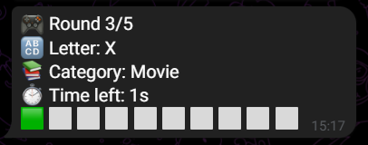
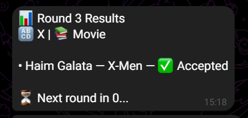
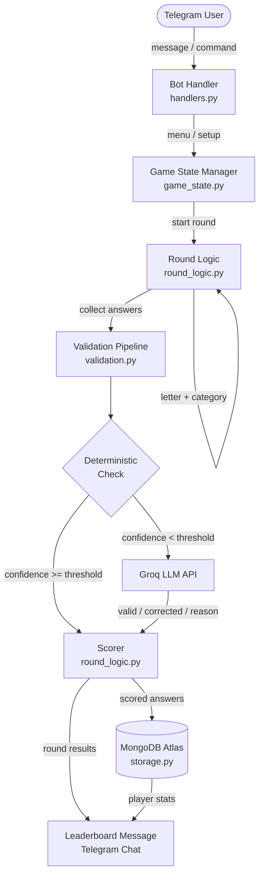

<div align="center">

<!-- Banner — drop assets/banner.png (1280×400, dark cyber theme) here -->


<br />


<br /><br />

[](https://t.me/CategoriesGame_bot)
[](https://python.org)
[](https://mongodb.com/atlas)
[](https://groq.com)
[](LICENSE)

<br />

**A fast-paced multiplayer word game for Telegram groups — powered by AI validation and real-time scoring.**

</div>

---

## Gameplay Preview

<div align="center">


<br /><br />

<table>
  <tr>
    <td align="center"></td>
    <td align="center"></td>
    <td align="center"></td>
  </tr>
  <tr>
    <td align="center"><sub>Round announced</sub></td>
    <td align="center"><sub>Players submit answers</sub></td>
    <td align="center"><sub>Live leaderboard</sub></td>
  </tr>
</table>

</div>

---

## How It Works

<div align="center">

<table>
  <tr>
    <td align="center" width="33%">
      <h3>📢 &nbsp;1. Start</h3>
      Add the bot to any Telegram group, send <code>/menu</code>, set player count and round duration, and the game kicks off with a 5-second countdown.
    </td>
    <td align="center" width="33%">
      <h3>⚡ &nbsp;2. Answer</h3>
      Each round reveals a random <strong>letter</strong> and <strong>category</strong>. Every player races to type their answer — first correct response earns the most points.
    </td>
    <td align="center" width="33%">
      <h3>🏆 &nbsp;3. Score</h3>
      Answers are validated by a hybrid AI pipeline. Scores are persisted to MongoDB, and a live leaderboard posts after every round.
    </td>
  </tr>
</table>

</div>

---

## Features

<table>
  <tr>
    <td><strong>🤖 Hybrid AI Validation</strong></td>
    <td>Deterministic checks run first; Groq LLM fallback triggers only when confidence is below threshold — fast and accurate.</td>
  </tr>
  <tr>
    <td><strong>✏️ Spell Correction</strong></td>
    <td>Tolerates realistic typos — <em>"Caihro"</em> is accepted and corrected to <em>"Cairo"</em> automatically.</td>
  </tr>
  <tr>
    <td><strong>🚫 Duplicate Detection</strong></td>
    <td>No two players in the same game can score with the same answer — enforced at the database level with compound unique indexes.</td>
  </tr>
  <tr>
    <td><strong>📊 Position-Based Scoring</strong></td>
    <td>Speed matters. First correct answer earns 10 pts, descending to 2 pts for 5th place and beyond.</td>
  </tr>
  <tr>
    <td><strong>⏱️ Configurable Rounds</strong></td>
    <td>Host sets round duration (minimum 5 s) and player count at game creation. Rounds end early when all players have answered.</td>
  </tr>
  <tr>
    <td><strong>🔄 Continue or Finish</strong></td>
    <td>After every 5 rounds the group votes to keep playing or end — no restart needed.</td>
  </tr>
  <tr>
    <td><strong>🗄️ MongoDB Persistence</strong></td>
    <td>All games, rounds, answers, and player stats are stored in MongoDB Atlas for historical tracking and future analytics.</td>
  </tr>
  <tr>
    <td><strong>📌 Round Pinning</strong></td>
    <td>The current round prompt is pinned in the group so latecomers never miss the category and letter.</td>
  </tr>
  <tr>
    <td><strong>👥 Up to 50 Players</strong></td>
    <td>Scales to large group chats — configurable upper limit via <code>MAX_PLAYERS</code>.</td>
  </tr>
  <tr>
    <td><strong>⚙️ Fail-Fast Config</strong></td>
    <td>Startup validates all required environment variables and exits with a clear error before the bot ever connects.</td>
  </tr>
</table>

---

## Architecture



---

## Tech Stack

<div align="center">


</div>

| Layer | Technology |
|---|---|
| Bot framework | `python-telegram-bot` v21+ (async, job queue) |
| AI validation | Groq API — `openai/gpt-oss-20b` (strict JSON mode) |
| Database | MongoDB Atlas — PyMongo 4.7+ |
| Configuration | `python-dotenv` + typed `AppSettings` dataclass |
| DNS resolution | `dnspython` (required for Atlas SRV URIs) |
| Runtime | Python 3.11+ |

---

## Getting Started

### Prerequisites

- Python 3.11+
- A Telegram bot token from [@BotFather](https://t.me/BotFather)
- A [Groq API key](https://console.groq.com)
- A [MongoDB Atlas](https://mongodb.com/atlas) connection string

### Quick Start

<details>
<summary><strong>Expand setup steps</strong></summary>

<br />

**1. Clone the repository**

```bash
git clone https://github.com/<your-org>/The-Categories-Game.git
cd The-Categories-Game
```

**2. Create a virtual environment and install dependencies**

```bash
python -m venv venv

# Windows
venv\Scripts\activate

# macOS / Linux
source venv/bin/activate

pip install -r requirements.txt
```

> Alternatively, use the included helper scripts:
> ```bash
> # macOS / Linux
> bash setup.sh
>
> # Windows PowerShell
> .\setup.ps1
> ```

**3. Configure environment variables**

```bash
cp .env.example .env
```

Open `.env` and fill in your credentials (see [Configuration](#configuration) below).

**4. Run the bot**

```bash
python -m src.main
```

Expected output:

```
Connecting to MongoDB...
MongoDB connected and indexes ensured.
Bot started successfully
>>> Starting polling...
```

</details>

---

## Configuration

Copy `.env.example` to `.env` and set the following variables:

| Variable | Required | Default | Description |
|---|---|---|---|
| `TELEGRAM_BOT_TOKEN` / `BOT_TOKEN` | ✅ | — | Telegram bot token from BotFather (either key is accepted) |
| `GROQ_API_KEY` | ✅ | — | Groq API key for LLM answer validation |
| `MONGODB_URI` | ✅ | — | MongoDB Atlas connection string |
| `GAME_ROUND_DURATION` | — | `30` | Round duration in seconds (minimum 5) |
| `MAX_PLAYERS` | — | `50` | Maximum number of players per game |
| `ENABLE_DUPLICATE_CHECK` | — | `true` | Reject answers already used in this game |
| `ENABLE_PINNING` | — | `true` | Pin/unpin the round prompt message |
| `LANGUAGE` | — | `en` | Answer language for validation context |
| `LLM_FALLBACK_ENABLED` | — | `true` | Enable Groq fallback when deterministic confidence is low |
| `CONFIDENCE_THRESHOLD` | — | `0.7` | Confidence cutoff before triggering LLM (0.0–1.0) |

---

## Gameplay Guide

1. **Add the bot** to a Telegram group and give it message permissions.
2. Send `/menu` → press **Start Game**.
3. The bot asks: *How many players?* — reply with a number.
4. The bot asks: *How many seconds per round?* — reply with a number (min 5).
5. A **5-second countdown** begins, then **Round 1** starts.
6. The bot posts the **letter** and **category** for the round (and pins the message).
7. Type your answer directly in the chat — your first message is your answer.
8. The round ends when **all players have answered** or **time runs out**.
9. The bot validates answers with AI, posts results and the **leaderboard**.
10. After **5 rounds**, a vote appears — choose to **Continue** or **Finish**.

---

## Scoring System

<div align="center">

| Place | Points |
|:---:|:---:|
| 🥇 1st correct answer | **10 pts** |
| 🥈 2nd correct answer | **8 pts** |
| 🥉 3rd correct answer | **6 pts** |
| 4th correct answer | **4 pts** |
| 5th+ correct answer | **2 pts** |
| Invalid / wrong letter / duplicate | **0 pts** |

</div>

Speed within a round determines your position — but every valid answer still earns points, so there's always a reason to compete even if you're not first.

---

## Project Structure

```
The-Categories-Game/
├── src/
│   ├── main.py          # Entry point — loads config, connects DB, starts bot
│   ├── bot.py           # PTB Application builder and handler registration
│   ├── handlers.py      # Command handlers, setup conversation, menu callbacks
│   ├── round_logic.py   # Round lifecycle: start, countdown, end, validate, score
│   ├── game_state.py    # In-memory game state per chat_id
│   ├── validation.py    # Hybrid validation pipeline + Groq API client
│   ├── storage.py       # MongoDB CRUD operations and index management
│   ├── models.py        # Dataclasses: GameState, Answer, Round, PlayerStats
│   ├── categories.py    # Category list
│   └── config.py        # Typed AppSettings + env validation
├── tests/
│   ├── test_game_state.py
│   ├── test_handlers.py
│   ├── test_round_logic.py
│   ├── test_storage.py
│   └── test_validation.py
├── docs/
│   └── README.md        # Technical planning document
├── assets/              # Screenshots, GIFs, banner (see below)
├── .env.example         # Environment variable template
├── requirements.txt
├── setup.sh
└── setup.ps1
```

---

## Roadmap

- [x] Core multiplayer round system
- [x] Hybrid deterministic + LLM validation
- [x] Position-based scoring
- [x] MongoDB persistence and leaderboards
- [x] Configurable game parameters
- [ ] Multilingual support (Hebrew, Arabic, Spanish, …)
- [ ] Web dashboard for game stats and player history
- [ ] Category difficulty tiers (Easy / Hard)
- [ ] ELO-style ranking across sessions
- [ ] `/stats` command for personal all-time records
- [ ] Themed category packs (Sports, Geography, Pop Culture)

---

## Contributing

Contributions are welcome. Please open an issue to discuss your idea before submitting a pull request.

**Branch strategy:**

| Branch | Purpose |
|---|---|
| `main` | Stable releases |
| `Dev` | Active development |
| Feature branches | Named per developer / feature |

```bash
git checkout Dev
git checkout -b feature/your-feature-name
# ... make changes ...
git push origin feature/your-feature-name
# Open a pull request targeting Dev
```

---

<div align="center">

<br />

---

Built for a hackathon &nbsp;·&nbsp; Powered by [Groq](https://groq.com) &nbsp;·&nbsp; Persisted on [MongoDB Atlas](https://mongodb.com/atlas)

<a href="#top">↑ Back to top</a>

</div>
